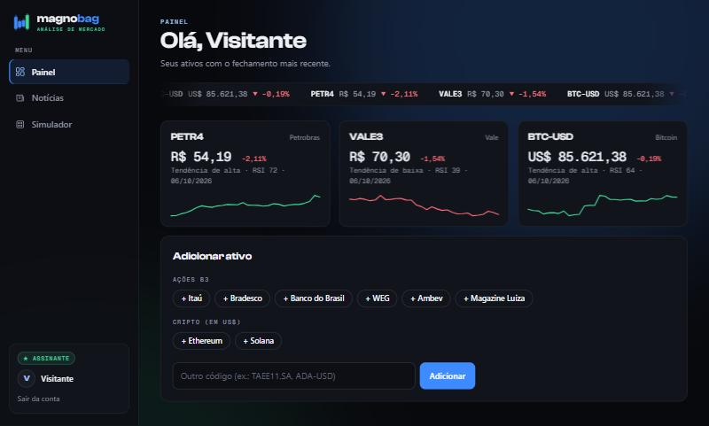

# Magnobag

Plataforma de análise de ações da B3, criptomoedas e câmbio: gráficos, indicadores, backtests,
notícias e um simulador que mostra o que acontece com quem segue bots de sinais com gale.

**Vitrine:** https://josefrancisco-alt.github.io/magnobag/

- Painel com cotações, tendência, RSI e mini gráficos
- Backtests honestos e taxa de acerto real de cada estratégia
- Notícias dos últimos 7 dias de cada ativo
- Simulador de gale (martingale)
- Cadastro, plano grátis, assinatura e funções exclusivas do dono
- Segurança: senhas com hash, proteção CSRF, limite de tentativas de login

Feito com Python (Flask, pandas, yfinance), SQLite, Chart.js e JavaScript puro.
Detalhes de como rodar, configurar e colocar no ar: [site/README.md](site/README.md).

> Projeto de estudo. Não é recomendação de investimento.
